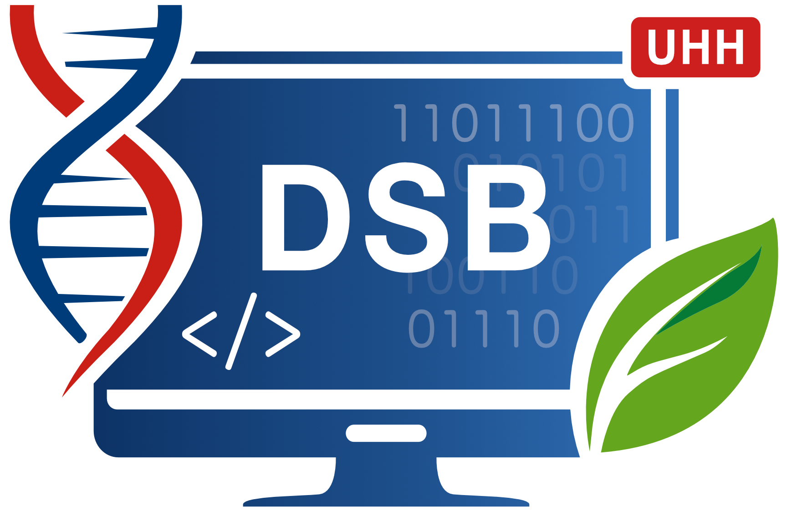

Data Science 3 - Exploratory Data Analysis & Data Mining
================

## Module description 

This is third out of four modules in the data science program newly
introduced into the Bachelor Programs of the **Biology Department,
University of Hamburg**. *Data Science 3* introduces students into the
world of statistical modelling of typically secondary bigger data sets.

Course creator: **Dr. Saskia Otto**

Course instructor: **Dr. Saskia Otto**, **Dr. Monika Eberhard**

## This repository

This Github repository holds just the links to the course-specific
interactive HTML lecture slides (all in German) produced by Saskia Otto
with [Quarto](https://quarto.org/).

The URL for the lecture slides is:
<https://saskiaotto.github.io/uham-bio-data-science-3/>

## License

This work is licensed under a [Creative Commons Attribution-ShareAlike
4.0 International
License](http://creativecommons.org/licenses/by-sa/4.0/) except for the
borrowed and mentioned with proper *source:* statements.
